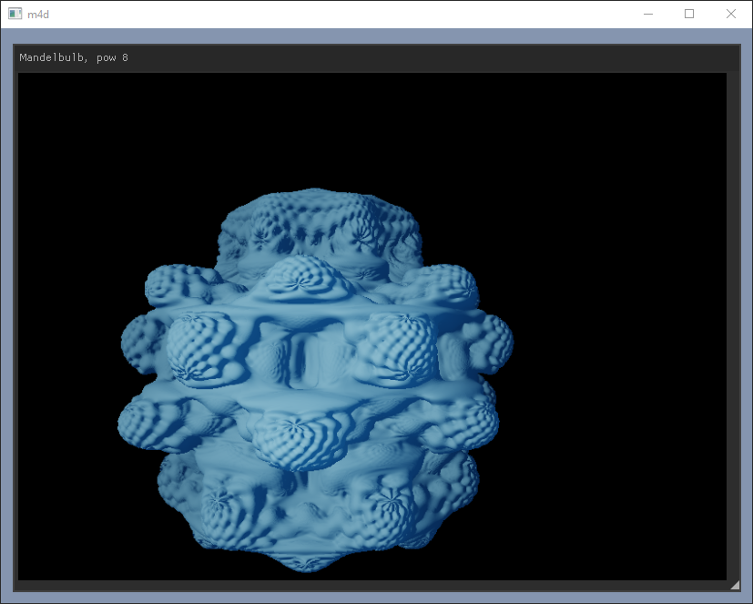

# mandelbulb-4d

State-of-the-art renderer, fine tuned to produce highly realistic visuals of arbitrary complex fractal 3D worlds




## Introduction

This project was born from the discussion [Remake of MB3D](http://www.fractalforums.com/mandelbulb-3d/mb3d-v2/) over at [Fractal Forums](http://www.fractalforums.com/). For the theory, please read [Mandelbulb (From Wikipedia, the free encyclopedia)](https://en.wikipedia.org/wiki/Mandelbulb).


## Similar projects

- [Mandelbulber v2](https://github.com/buddhi1980/mandelbulber2)
- [Mandelbulb3D](https://github.com/thargor6/mb3d)
- [Fragmentarium](https://github.com/Syntopia/Fragmentarium)


## Build instructions

Currently this is a work in progress. On windows, I build binaries using cmake and MinGW-64-bit (from RubenVB for
[64-bit Windows target](http://sourceforge.net/projects/mingw-w64/files/Toolchains)). On Linux, I build using cmake and
the GCC collection. On Mac OS, I build using cmake and the command line developer tools. Most libraries are included as
part of the source. You only need to make sure you have OpenCL development files (headers) on your system.

Sample steps to build on Linux:

```
  git clone __ADDRESS_OF_THIS_REPO__
  cd mandelbulb-4d
  mkdir build
  cd build

  cmake ../src
  make -j 4

  cp ../src/hello.cl .

  ./mb4d_gui
```

Cheers!


## License

This project is licensed under the MIT license. See [LICENSE](LICENSE) for more details.
